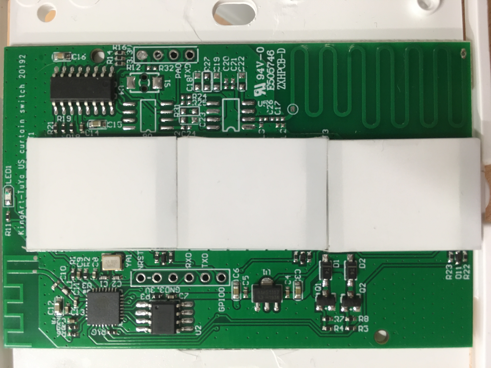
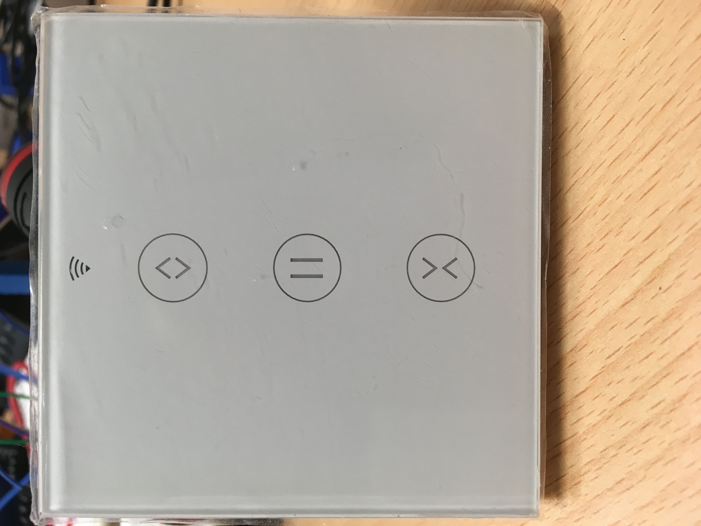

# KingArt-TuYa
Curtain Switch




## Tasmota-Template
```{"NAME":"KingArt-TuYa","GPIO":[544,0,0,162,0,32,0,0,33,225,290,224,0,0],"FLAG":0,"BASE":18}```

  GPIO | function
-------|------------
gpio00 | led state
gpio01 | none
gpio02 | none
gpio03 | button middle
gpio04 | none
gpio05 | button up
gpio12 | button down
gpio13 | relay close
gpio14 | led middle
gpio15 | relay open
gpio16 | none
gpio17 | analog (none)
